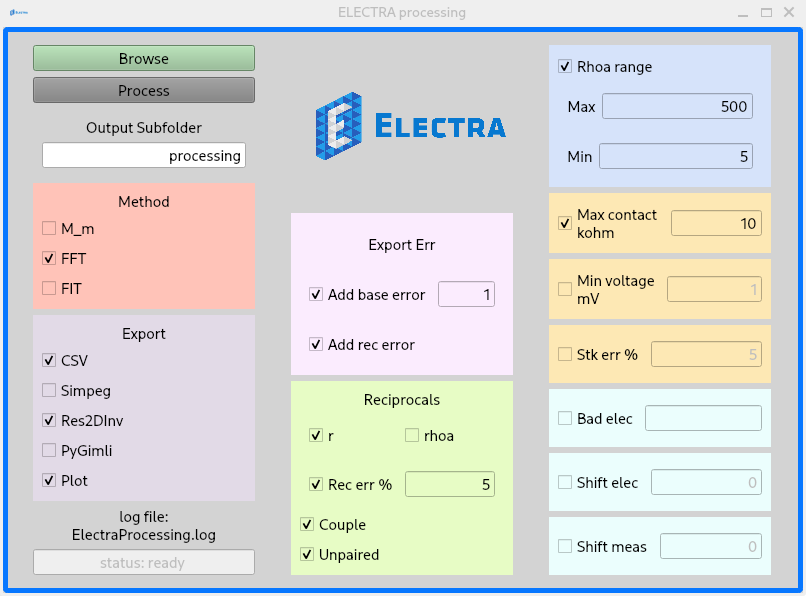

Electra Processing Tool
===

<p align="center"></p>

<!-- {width=50%} -->

Installation
---
The graphical user interface (GUI) uses PySide6, the Python bindings of QT.

To avoid conflicts while installing PySide6 it is better to prepare a separate Python virtual environment.
If Python is already installed on the computer, use [virtualenv](https://virtualenv.pypa.io/en/latest/) to create the new environment.
The use of the virtual environment avoids creating conflicts with the operative system and other software that rely on the installed Python and its packages.
If Python is not available on the system, download first a generic Python from the Python official website or Conda.

The app was developed and tested on Python 3.9, but it should work also with successive versions.
Note that `virtualenv` will create a Python environment based on the version of its Python.
Therefore, `virtualenv` should be running on Python 3.9 if the virtual environment has be with version 3.9.

Create a directory to contain the python environment and then run
```
virtualenv ~/path/to/directory
```

Activate the virtual environment.
On Linux:
```
source ~/path/to/directory/bin/activate
```
On Windows:
```
C:\Users\user\path\to\directory\Scripts\activate
```

There are different ways to check which Python is active.
From the command line (on linux)
```
which python
```
From the Python shell (any platform)
```
import sys
print(sys.exec_prefix)
```

Once the environment is active, there are some options:
1. automatically install with `pip` from `github`
Run `pip install git+https://github.com/Peruz/ElectraProcessing`.
This will automatically install all the dependencies and then the app in the `path\to\directory\Lib\site-package\electra_processing`.

2. clone from the github repository (`git clone https://github.com/Peruz/ElectraProcessing`) and install the app by running `pip install -e .` in the cloned directory.
`pip` will automatically install the dependencies based on the `setup.py` file, which will be in the cloned folder.

3. clone from the github repository and manually install the dependencies with the following commands:
```
pip install PySide6
pip install pandas
pip install numpy
pip install numba
pip install scipy
pip install IPython
pip install matplotlib
pip install datetime
pip install argparse
```

At this point, try running the app with
```
python ertgui.py
```
Install any missing module with `pip`.

You are ready to use the app.

Distribute
---

I recommend using `pyinstaller` to build the app and make it easy to distribute.
Always within the virtual environment run
```
pip install pyinstaller
```
and then
```
pyinstaller ertgui.py
```
This creates a **dist** forlder wherein thereis the built app, for example
```
dist/ertgui/ertgui
```
it may have the `.exe` extension on Windows.

It is possible to distribute the dist folder and run the app by clicking on the built executable.
Creating a shortcut may be useful.

How does the app work?
---

The app is very simple and the default options will do just fine.
Start by browsing the file to be processed, they should be exported with the **custom export - complete** from the Electra manager.
At this point, check:
1. that the desired export options are active (e.g., Res2DInv, CSV, Plot)
2. that the **base error** is set to a reasonable percentage: 5 if no reciprocal error will be added, 1 or 2 if reciprocal error will be added.
3. that the reciprocal options are in line with the dataset; disable the reciprocal check if the dataset that not have reciprocal measurements.
If only part of the dataset contains reciprocal measurements, or another file when processing multiple files, enable **unpaired** to keep the measurements without reciprocals.
4. if the **rhoa** range is ok.
5. that the control of the contact-resistance is active and with a value suitable for the Electra (10 kohm).

Press the **Process** button and check the output directory.
A log of the processing should be save in the `ElectraProcessing.log`, which is in the app directory.


